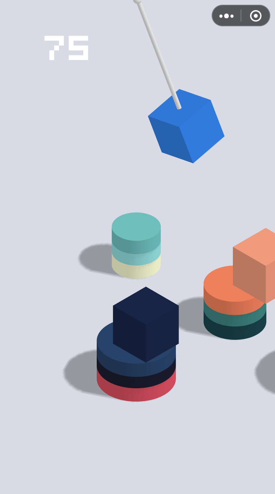
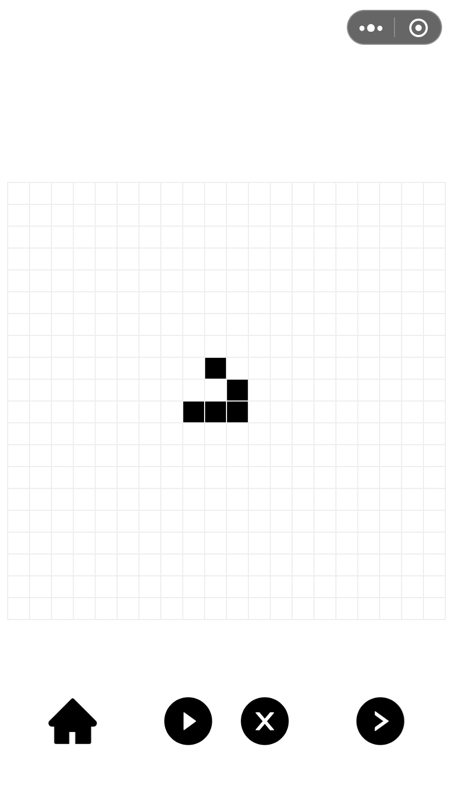
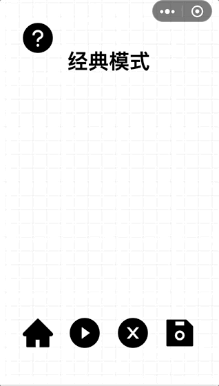

# Life-swings

- [Life-swings](#life-swings)
  - [Overview](#overview)
  - [Why is it](#why-is-it)
  - [How to play](#how-to-play)
    - [Pass mode](#pass-mode)
    - [Classic mode](#classic-mode)
  - [Future works](#future-works)

## Overview

Life-swings is a 3D WeChat game that combines "Building a House" and "Game of Life".

*Building a House* is a game in which the player operates a hoist that continuously performs a single pendulum movement, and releases the suspended floors at the right moment. The fallen floors are stacked one after another. The higher the pile, the higher the score.

*Game of Life* is a kind of cellular motivation. Players place some cells in a dead or dead state on a two-dimensional plane. The state of each cell at the next moment is determined by the state of nearby cells in accordance with certain rules. The charm of the life game is that the simple initial state and rules can be evolved to produce complex and wonderful graphics, **life is born on the edge of chaos.**

&emsp;&emsp;

## Why is it

On the one hand, this game is to cherish the memory of the British mathematician [John Horton Conway](https://nl.wikipedia.org/wiki/John_Horton), who died due to the epidemic. We hopes that after the epidemic, everything grows.

On the other hand, we hope that users will experience the swinging creation of life and the process of its reproduction so that more people can learn about life games and experience the fun of creation.

**Life is growing up amidst stumbling, and prosper in swing.**

## How to play

The game contains two modes: pass mode and classic mode.

The pass mode is designed to help the player complete the initial life state's layout through a series of set initial patterns; the classic mode provides an empty and whiteboard, and the player can freely create the initial state.

Both of these modes can automatically evolve according to the initial state, allowing players to experience the fun of creating life.

### Pass mode

There are a total of 20 levels in the pass mode.

The scene will gradually form a series of cylinders at each level, which will be arranged in a specific way. Each cylinder represents a cell. They need the energy to multiply, and the energy comes from a single pendulum that constantly swings. Energy blocks are hanging on the pendulum. Players need to tap the screen at the right time to let the energy blocks fall. Only when the energy block falls in the cell's proper position, the pendulum will automatically move to the next position. Otherwise, the game will fail.

The color of the energy block, the pendulum's speed, and the size of the cell will change depending on the position.

When all cells have energy, they can begin to evolve. Players can observe how these simple cells evolve into complex and beautiful patterns.

### Classic mode

After the player has learned the mystery of the proliferation of life games through the pass-through mode, they can go to the classic mode to easily modify the cell state by clicking on the checkerboard and experience the fun of creating life from start to end.

## Future works

- The WeChat version of Life Swings is still in experience version, it will publish official version soon.
- Refactor the code and add more features.
- Write a H5 version of Life Swings.
